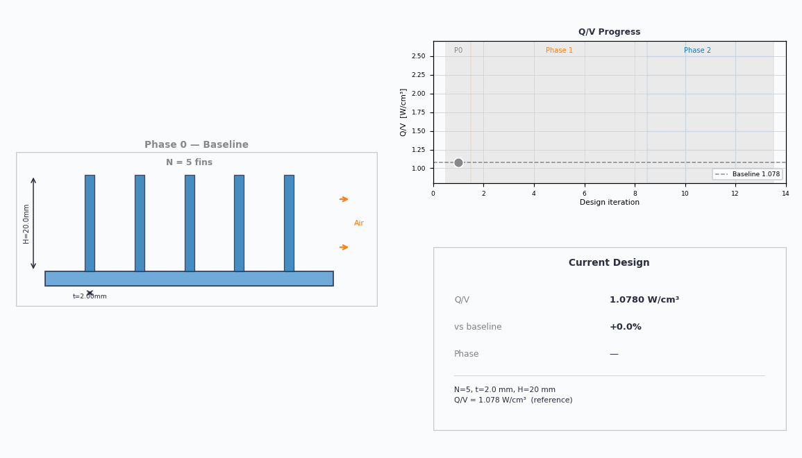

<!-- Heatsink Optimization Series — public code companion -->
<h1 align="center">🔥 Heatsink Optimization Series</h1>

<p align="center">
  <b>Wrapping OpenFOAM in Python and letting a Bayesian optimizer redesign a heatsink — from scratch.</b><br>
  Same footprint. Same fan. <b>More than double the cooling.</b>
</p>

<p align="center">
  
</p>

<p align="center">
  <a href="https://www.youtube.com/@CFD_OpenFOAM"></a>
  
  
  
  
</p>

---

## The one-line story

We took an ordinary aluminium plate-fin heatsink and let an algorithm search the
design space — running ~30 CFD simulations to find the geometry that dissipates
the most heat **per unit volume** (Q/V). The winner: **11 razor-thin fins**.

| Metric | Baseline | Optimized | Change |
|--------|:--------:|:---------:|:------:|
| Fins × thickness | 5 × 2.0 mm | 11 × 1.01 mm | — |
| Specific heat rate **Q/V** | 1.08 W/cm³ | **2.02 W/cm³** | **+87%** ¹ |
| Thermal resistance **R_th** | 2.14 K/W | **0.53 K/W** | **−75%** |

<sub>¹ +87% is the high-fidelity CHT-validated figure. The fast optimization search estimated +106% (Q/V ≈ 2.22).</sub>

<p align="center">
  
</p>

---

## 📺 The Series — episode → code map

Code for each episode is published **when that episode goes live**. Episode 1 is
pure motivation, so it has no code.

| # | Episode | Watch | Code | Status |
|:-:|---------|:-----:|------|:------:|
| 1 | **Why Optimize a Heatsink?** | _coming soon_ | [`episode-01-why-optimize/`](episode-01-why-optimize/) — planner &amp; background | ✅ |
| 2 | **The Baseline: One Case, End to End** | _coming soon_ | [`episode-02-baseline/`](episode-02-baseline/) | ✅ |
| 3 | **Automating CFD: Parametric Sweeps** | _coming soon_ | `episode-03-parametric-sweeps/` | 🔜 |
| 4 | **Bayesian Optimization, Explained** | _coming soon_ | — (theory) | 🔜 |
| 5 | **Running the Optimization Loop** | _coming soon_ | `episode-05-optimization-loop/` | 🔜 |
| 6 | **The Optimal Design & CHT Validation** | _coming soon_ | `episode-06-cht-validation/` | 🔜 |
| 7 | **Full Code Walkthrough & GitHub** | _coming soon_ | this repo | 🔜 |

> ⏳ = airing soon · ✅ = code available · 🔜 = drops with its episode

---

## The design problem

Maximise the **specific heat dissipation** Q/V [W/cm³] of a forced-convection
plate-fin heatsink — i.e. get the most cooling out of the least metal.

| Variable | Symbol | Range |
|----------|:------:|-------|
| Number of fins | N | 3 – 11 |
| Fin thickness | t | 1.0 – 3.0 mm |
| Fin height | H | 10 – 30 mm |

**Fixed:** 60 × 60 mm footprint · 3 mm base · 3 m/s inlet · aluminium.

The three knobs fight each other — more fins add surface area but choke the
airflow; thinner fins pack in more but conduct less; taller fins help with
diminishing returns. Finding the sweet spot is exactly what the optimizer is for.

---

## How it works (the pipeline)

```
   Python  ──▶  parametric STL  ──▶  OpenFOAM (mesh + solve)  ──▶  extract Q
      ▲                                                              │
      └──────────────  Optuna (Bayesian optimization)  ◀────────────┘
```

1. A Python script turns three numbers (N, t, H) into a heatsink STL — **no CAD**.
2. OpenFOAM meshes it (`snappyHexMesh`) and solves the buoyant flow (`buoyantSimpleFoam`).
3. The heat dissipated Q is extracted and fed back to **Optuna**, which proposes
   the next design to try — learning as it goes.
4. The winner is re-validated with full **conjugate heat transfer** (`chtMultiRegionSimpleFoam`).

---

## Repository layout

```
Heatsink-Optimization-Series/
├── README.md                       ← you are here
├── assets/                         ← GIFs / images for this page
├── episode-01-why-optimize/        ← Ep 1: planner &amp; background (the why + the plan)
├── episode-02-baseline/            ← Ep 2: one full OpenFOAM case, end to end
│   ├── case/                       #   the OpenFOAM case (0/, constant/, system/)
│   └── scripts/                    #   parametric STL generator
├── episode-03-parametric-sweeps/   ← Ep 3  (drops with the episode)
├── episode-05-optimization-loop/   ← Ep 5  (drops with the episode)
└── episode-06-cht-validation/      ← Ep 6  (drops with the episode)
```

---

## Prerequisites

- **OpenFOAM 2506** (Linux, or a VM on macOS/Windows)
- **Python 3.11** with `numpy-stl`, `optuna`, `pyvista`, `pandas`, `matplotlib`
- **ParaView** (optional, for the renders)

Each episode folder has its own README with the exact steps to run it.

---

## License

Apache 2.0 — see [`LICENSE`](LICENSE). Use it, fork it, point it at your own geometry.

---

<p align="center"><sub>Built for <a href="https://www.youtube.com/@CFD_OpenFOAM">@CFD_OpenFOAM</a> · OpenFOAM · Optuna · Python · ParaView</sub></p>
