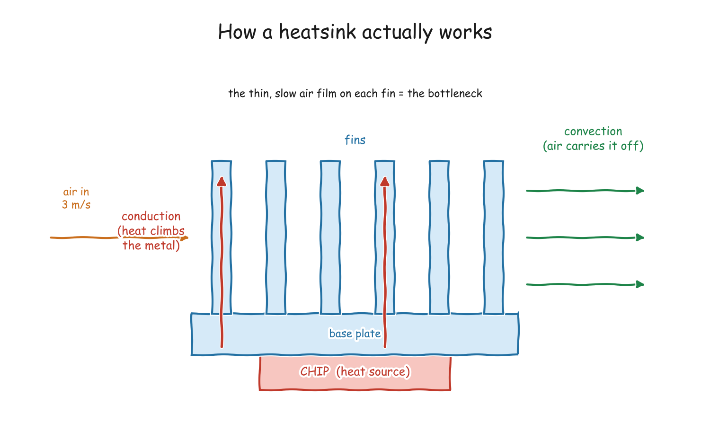
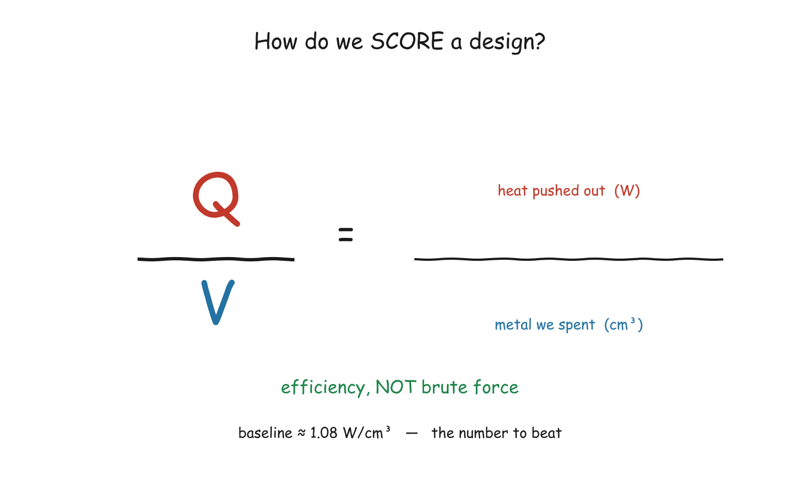
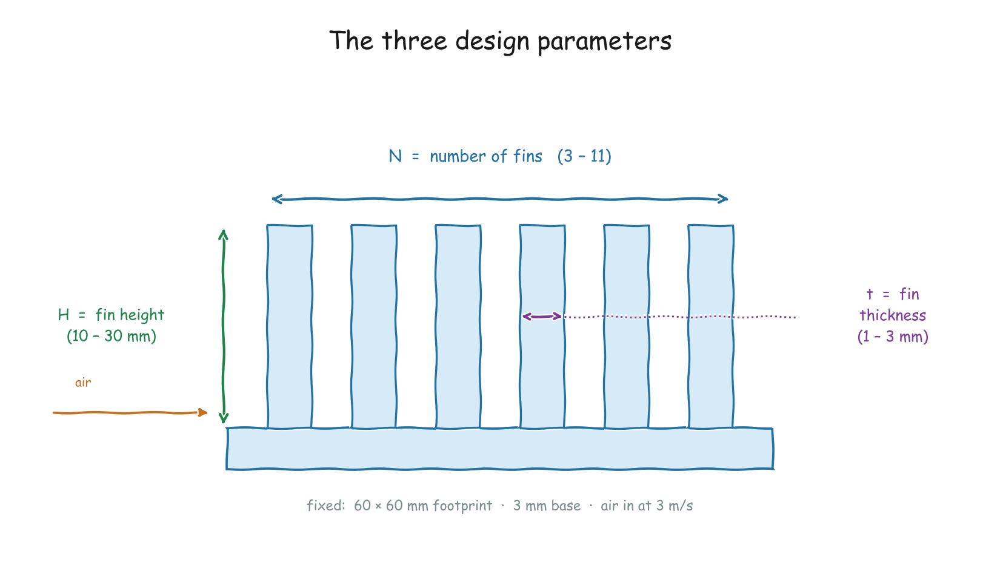
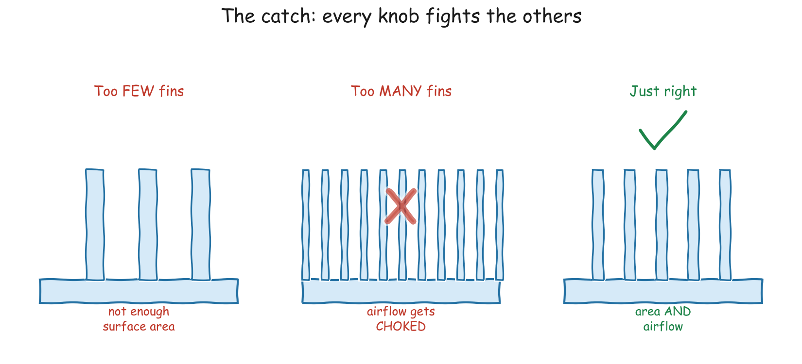
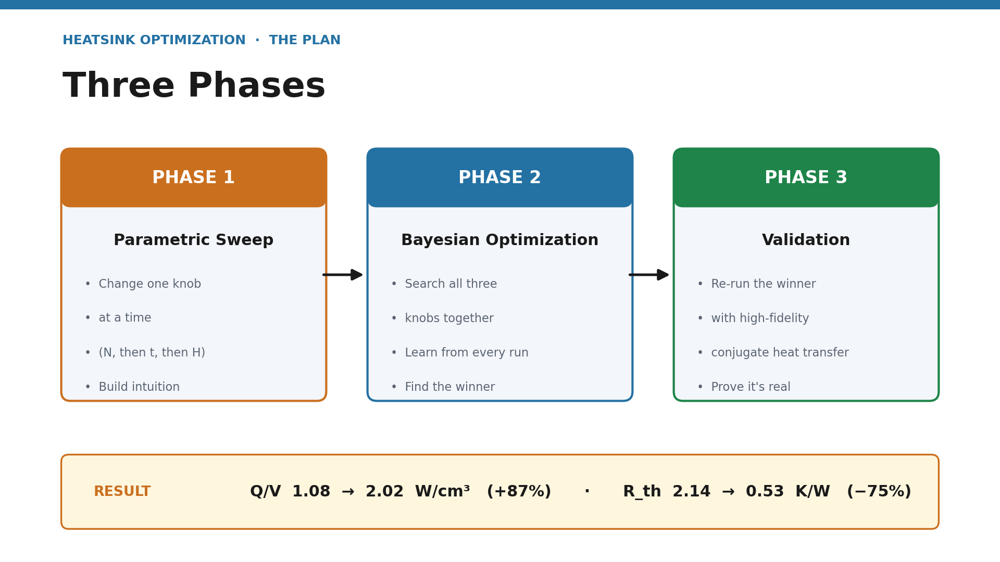
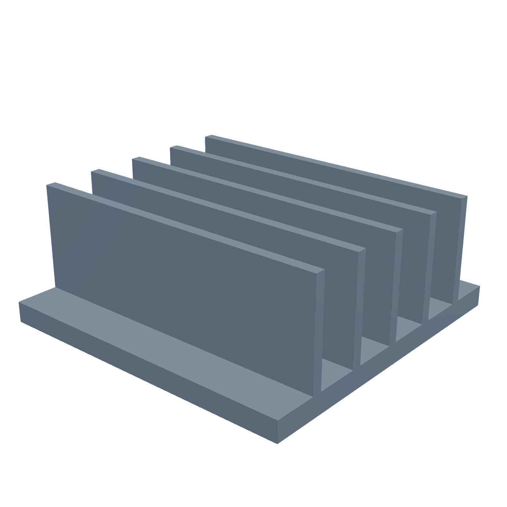
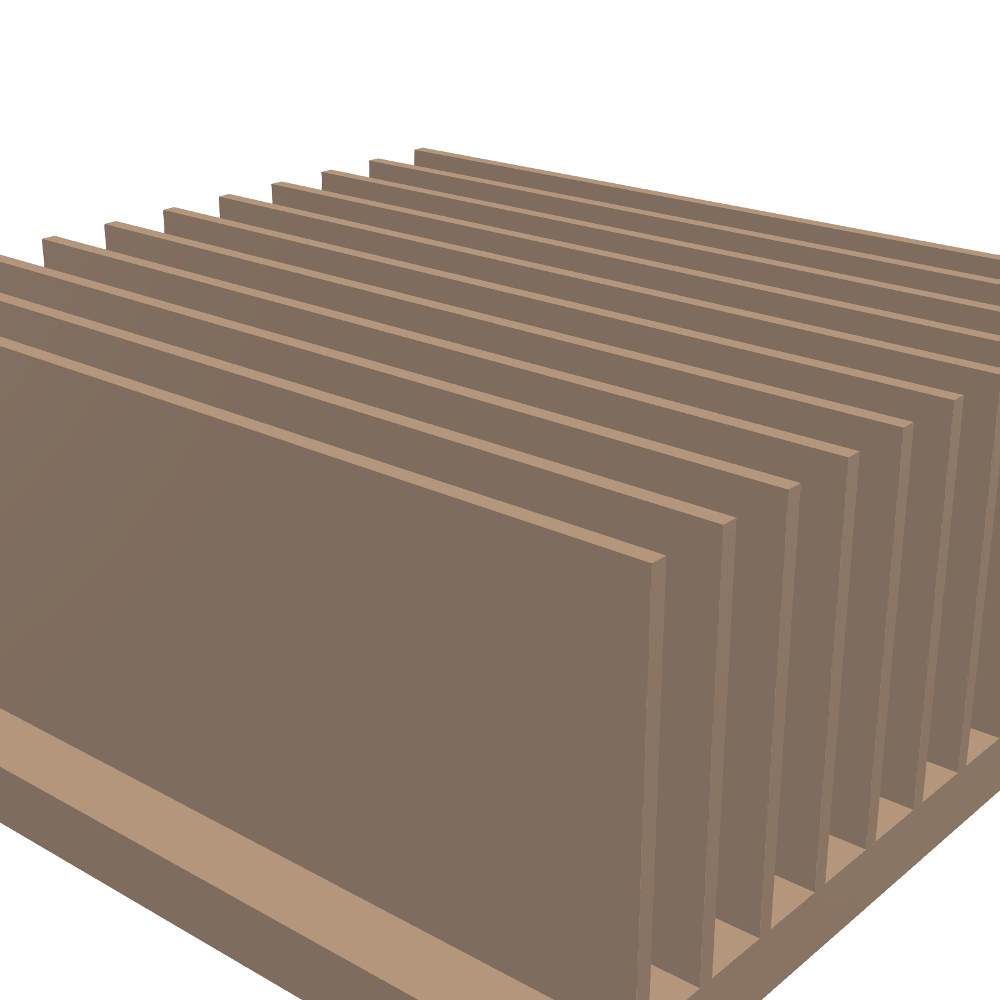
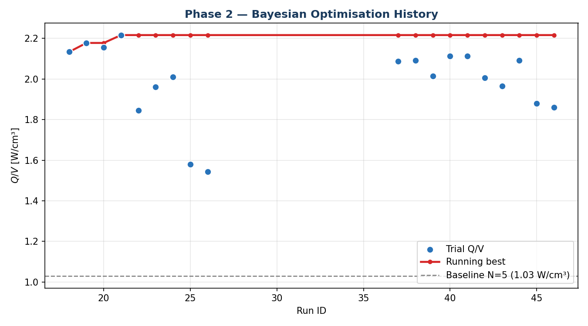
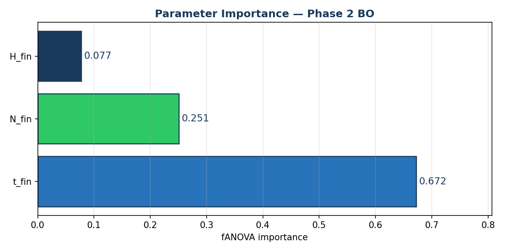
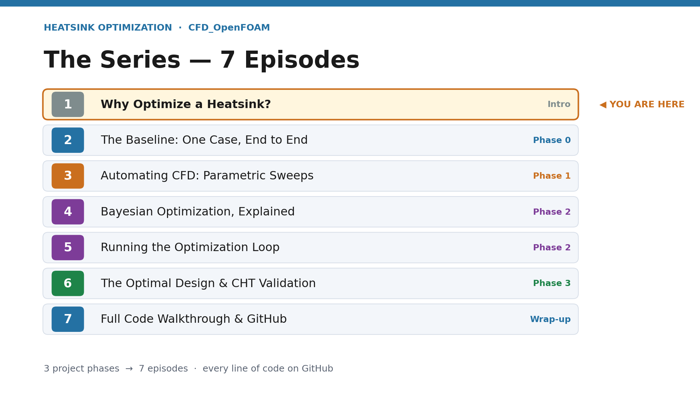

# Episode 1 — Why Optimize a Heatsink?

📺 **Watch:** _coming soon_ · Part of the [Heatsink Optimization Series](../README.md)

> This is the **planner & background** for the whole series — the *why* and the
> *plan*, before any code. No simulations here, just the thinking.

  

---

## 1. The problem — heat has to go somewhere

Every chip is a tiny electric heater. Push it harder and it dumps more heat, and
if that heat has nowhere to go the chip **throttles** itself to survive. A
heatsink's whole job is to move heat from a hot base out into moving air — first
by **conduction** up through the fins, then by **convection** into the airflow.

  

The shape of those fins — how many, how thick, how tall — completely changes how
well that works. So the real question is: **what is the best possible shape?**

---

## 2. The objective — turning "good" into a number

"Best" needs a number, or we could just cheat by making the heatsink enormous
(more metal always cools more). So we optimize **efficiency**, not brute force:

  

**Q / V** — watts of heat dissipated per cubic centimetre of aluminium. Our
starting **baseline scores Q/V = 1.08 W/cm³**. Everything in the series is about
beating that number.

---

## 3. The parameters we control

We hold the footprint, base, and airflow fixed, and let the optimizer turn just
**three knobs**:

  

| Knob | Symbol | Range | What it changes |
|------|:------:|-------|-----------------|
| Number of fins | **N** | 3 – 11 | more fins = more surface area |
| Fin thickness | **t** | 1.0 – 3.0 mm | thinner = more fins fit, but less conduction |
| Fin height | **H** | 10 – 30 mm | taller = more area, with diminishing returns |

**Fixed:** 60 × 60 mm footprint · 3 mm base · 3 m/s inlet · aluminium.

---

## 4. Why it's hard — the three knobs fight each other

There's no simple "turn this up" answer. Cram in too many fins and you choke the
airflow; make them too thin and they can't carry heat to the tip; make them too
tall and the top just sits in already-warm air.

  

A three-way trade-off like this is exactly what a human is bad at and an
optimizer is very good at.

---

## 5. The plan — three phases

  

1. **Parametric sweep** — change one knob at a time to build intuition.
2. **Bayesian optimization** — let Optuna search all three knobs together,
   learning from every CFD run.
3. **Validation** — re-run the winner with high-fidelity conjugate heat transfer
   to make sure it's real, not just gaming a simplified model.

---

## 6. The results we actually saw

The optimizer converged on **11 razor-thin fins** — a design that sounds wrong
(surely that chokes the airflow?) but wins.

  
  &nbsp;&nbsp;➜&nbsp;&nbsp;
  

| Metric | Baseline | Optimized | Change |
|--------|:--------:|:---------:|:------:|
| Fins × thickness | 5 × 2.0 mm | 11 × 1.01 mm | — |
| **Q/V** | 1.08 W/cm³ | **2.02 W/cm³** | **+87%** ¹ |
| **R_th** | 2.14 K/W | **0.93 K/W** | **−56%** ¹ |

¹ Boundary-layer-resolved validated figures (R_th = ΔT/Q, fixed 350 K wall). The fast coarse-mesh search estimated more (Q/V ≈ 2.22 / +106%; R_th ≈ 0.85 K/W). See Episode 6 for the validation.

The optimizer found the answer in under ten simulations — and fin thickness
turned out to matter most:

  
  

---

## 7. The seven-episode plan

  

| # | Episode | Code |
|:-:|---------|------|
| 1 | Why Optimize a Heatsink? *(you are here)* | — |
| 2 | The Baseline: One Case, End to End | [`episode-02-baseline/`](../episode-02-baseline/) |
| 3 | Automating CFD: Parametric Sweeps | drops with the episode |
| 4 | Bayesian Optimization, Explained | — (theory) |
| 5 | Running the Optimization Loop | drops with the episode |
| 6 | The Optimal Design & CHT Validation | drops with the episode |
| 7 | Full Code Walkthrough & GitHub | this repo |

---

**Next up →** [Episode 2](../episode-02-baseline/) builds the baseline heatsink
from a blank OpenFOAM case to a real result — and gets us the number to beat.
