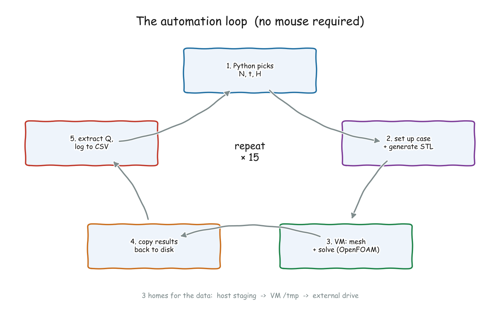
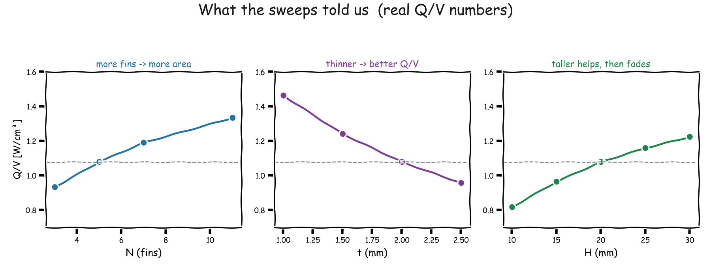

# Episode 3 — Automating CFD: Parametric Sweeps

📺 **Watch:** _coming soon_ · Part of the [Heatsink Optimization Series](../README.md)

Episode 2 ran **one** case by hand. This episode wraps the whole workflow in
Python and runs **fifteen** cases with a single command — sweeping each design
knob one at a time to build intuition before the real optimization.

<p align="center">
  
</p>

The loop is five moves: **Python picks the parameters → generates the STL → the
VM meshes &amp; solves → results come back → we extract Q and log it to a CSV**,
then repeat. Once it exists, running 15 cases is the same effort as running 1.

---

## What's in here

```
episode-03-parametric-sweeps/
├── optimize_heatsink.py       ← the driver (sweep / single / check subcommands)
├── run_openfoam.sh            ← the VM-side pipeline (blockMesh → snappy → solve)
├── plot_results.py            ← plots Q/V vs N, t, H from the sweep CSVs
├── scripts/
│   └── generate_heatsink_stl.py   ← parametric STL generator
├── openfoam-template/         ← the base OpenFOAM case that every run is patched from
├── environment.yml            ← conda environment
└── setup.sh
```

---

## The sweeps

Each sweep varies **one** knob and holds the other two fixed:

```bash
conda env create -f environment.yml && conda activate heatsink-opt

# verify the VM / paths first
python optimize_heatsink.py check

# Sweep A — number of fins
python optimize_heatsink.py sweep --variable N_fin --values 3 5 7 9 11

# Sweep B — fin thickness (metres)
python optimize_heatsink.py sweep --variable t_fin --values 0.001 0.0015 0.002 0.0025 0.003

# Sweep C — fin height (metres)
python optimize_heatsink.py sweep --variable H_fin --values 0.010 0.015 0.020 0.025 0.030
```

Every run appends a row to `results.csv`, and each sweep writes a summary CSV you
can plot with `python plot_results.py`.

---

## What the sweeps told us

<p align="center">
  
</p>

- **More fins** → Q/V climbs (more surface area), all the way to N = 11.
- **Thinner fins** → Q/V climbs hard: going 2 mm → 1 mm lifts Q/V from 1.08 to
  **1.46** — the best single result so far.
- **Taller fins** → helps, but with diminishing returns (the top of a tall fin
  sits in already-warm air).

**The catch:** each sweep only moves one knob while the other two sit at their
defaults. The real optimum is a *combination* no single sweep visits — which is
exactly why Episode 5 brings in Bayesian optimization.

---

## ⚙️ Configuration — change these for your setup

The paths are **pre-set to run from a fresh clone** — the template, the STL
script, and a local `results/` folder are all bundled and wired up. You only
need to edit **two** machine-specific values in the config block near the top of
[`optimize_heatsink.py`](optimize_heatsink.py):

| Variable | Default in the repo | Change it to |
|----------|---------------------|--------------|
| `_MULTIPASS_HOST` | `/Users/.../Multipass_Files` | **your** Multipass shared-mount path |
| `VM_NAME` | `rewarded-bluefish` | **your** OpenFOAM VM name |

Already wired up (no edit needed): `TEMPLATE_DIR → ./openfoam-template`,
`SCRIPTS_DIR → ./scripts`, `RESULTS_DIR → ./results` (results land in the repo
folder and are git-ignored; repoint it anywhere if you prefer).

If you run OpenFOAM **natively** (not in a VM), the driver's structure still
applies — you'd just point `run_openfoam.sh` at your local OpenFOAM instead of
`multipass exec`.

---

## Requirements

- **OpenFOAM 2506** (in a VM or native)
- **Python 3.11** — `conda env create -f environment.yml` (numpy-stl, pandas, matplotlib, pyvista)

---

**Next up →** Episode 4 explains *why* Bayesian optimization beats brute force,
and Episode 5 turns this sweep loop into a full optimization loop.
