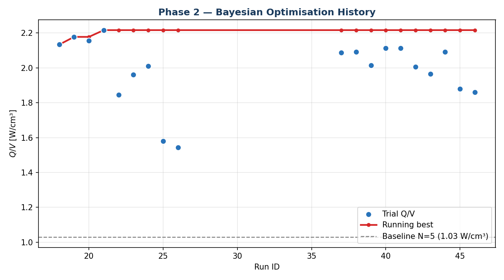
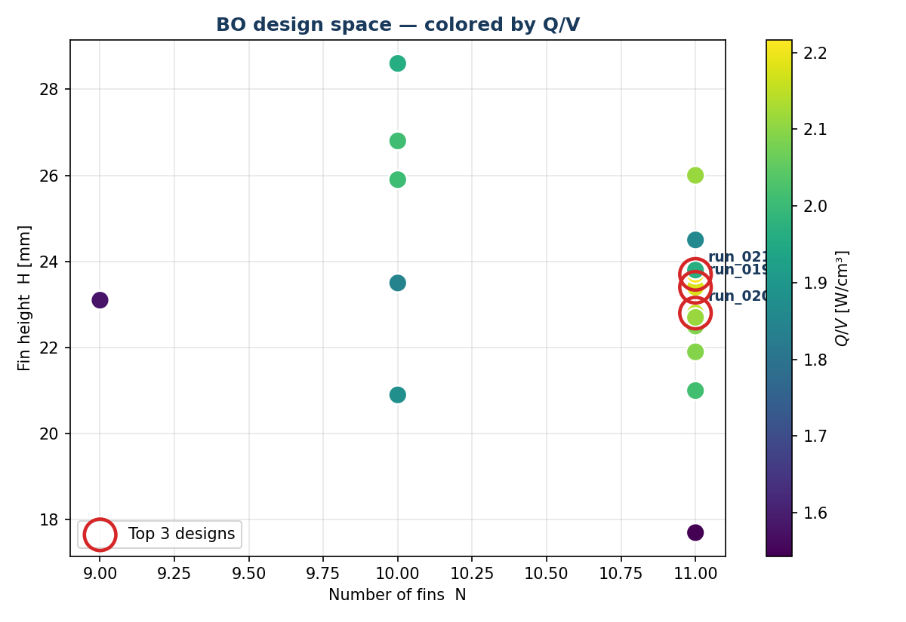
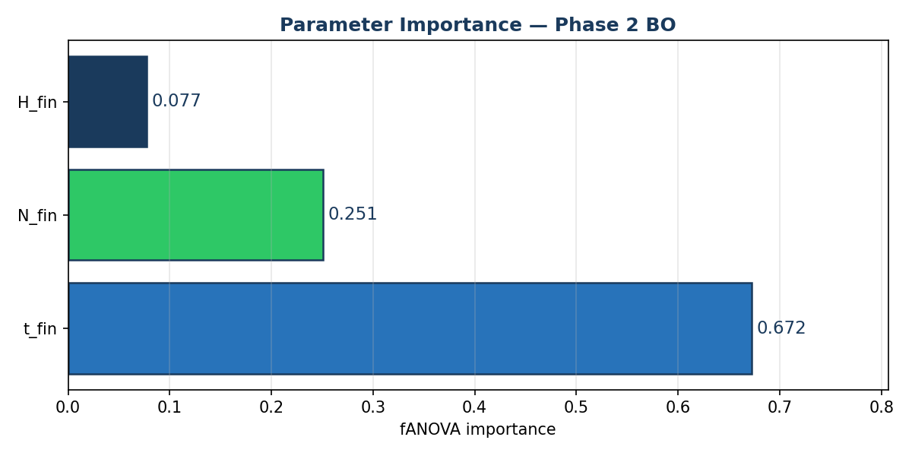

# Episode 5 — Running the Optimization Loop

📺 **Watch:** _coming soon_ · Part of the [Heatsink Optimization Series](../README.md)

Episode 3 swept one knob at a time. Episode 4 explained the *theory* of Bayesian
optimization. This episode is where it all comes together: a **closed loop** that
lets [Optuna](https://optuna.org)'s TPE sampler propose designs, runs each one as
a real CFD evaluation on the VM, learns from the result, and proposes the next —
until it converges on the best heatsink in the design space.

<p align="center">
  
</p>

Every blue dot is one ~8-minute CFD run; the red line is the **best design found
so far**. Notice how it locks onto the optimum within a handful of evaluations
and never looks back — that's the whole promise of BO over brute force.

---

## What's in here

```
episode-05-optimization-loop/
├── optimize_heatsink.py       ← the driver — now with the `optimize` subcommand
├── run_openfoam.sh            ← the VM-side pipeline (blockMesh → snappy → solve)
├── plot_bo_results.py         ← BO-specific plots (history, importance, contour)
├── plot_results.py            ← the sweep plots from Episode 3 (still handy)
├── scripts/
│   └── generate_heatsink_stl.py   ← parametric STL generator
├── openfoam-template/         ← the base OpenFOAM case every trial is patched from
├── environment.yml            ← conda environment
└── setup.sh
```

The driver is the **same file** you've seen grow across the series. Episode 3 used
its `sweep`/`single` subcommands; here we use `optimize`. (It also carries a
`validate` subcommand — that's Episode 6.)

---

## The loop, in code

Bayesian optimization sounds heavy, but the core is a single **objective
function** that Optuna calls over and over. Here's the heart of it (from
[`optimize_heatsink.py`](optimize_heatsink.py)):

```python
def objective(trial):
    # 1. TPE proposes a design in the mixed int/continuous space
    t_fin = trial.suggest_float("t_fin", 0.001, 0.003)   # metres
    N_fin = trial.suggest_int  ("N_fin", 3,     11)       # integer!
    H_fin = trial.suggest_float("H_fin", 0.010, 0.030)

    # 2. Prune impossible designs BEFORE paying for CFD
    ok, reason = is_manufacturable(t_fin, N_fin, H_fin)
    if not ok:
        raise optuna.TrialPruned()          # ~free — no 8-min run wasted

    # 3. The expensive part: one real CFD evaluation on the VM
    Q, V = run_single(t_fin=t_fin, N_fin=N_fin, H_fin=H_fin)

    # 4. Objective = Q/V, with a soft penalty if it fails the thermal spec
    Q_over_V = Q / V
    if Q < BASELINE_Q:                       # must still beat the baseline
        return Q_over_V - 10.0 * (BASELINE_Q - Q) / BASELINE_Q
    return Q_over_V
```

Four ideas make this loop practical, and each is worth understanding:

### 1. Mixed search space
Number of fins `N` is an **integer**; thickness `t` and height `H` are
**continuous**. TPE handles this natively — no rounding hacks. This is the main
reason we use Optuna's TPE rather than a plain Gaussian-process BO.

### 2. Prune before you pay
A CFD run costs ~8 minutes. Many random designs are physically impossible — fins
packed too tightly to machine, or so tall and thin they'd buckle. We reject those
**instantly**, before meshing, so the optimizer never wastes a run on them:

```python
MIN_SPACING      = 0.0015   # 1.5 mm — min channel width between fins
MAX_ASPECT_RATIO = 25.0     # H/t    — fin buckling limit during extrusion

def is_manufacturable(t_fin, N_fin, H_fin):
    s = (W - N_fin * t_fin) / (N_fin + 1)      # channel spacing
    if s < MIN_SPACING:            return False, "fins too close to machine"
    if H_fin / t_fin > MAX_ASPECT_RATIO: return False, "fins too tall/thin"
    return True, "ok"
```

Pruning keeps TPE focused on the **feasible** region instead of chasing
impossible corners of the design space.

### 3. Warm-start from Episode 3
We don't start blind. The 15 sweep runs from Episode 3 are loaded straight into
the study as completed trials, so TPE begins with real knowledge of the
landscape:

```python
study.add_trial(optuna.trial.create_trial(
    params={"t_fin": t, "N_fin": N, "H_fin": H},
    distributions={...}, value=Q_over_V,
))
```

Free data is the best data — every prior evaluation makes the next proposal
smarter.

### 4. Resumable, logged, crash-proof
The study lives in a **SQLite** database, so the whole run is resumable. Kill it,
reboot, come back tomorrow — rerun the same command and it picks up exactly where
it left off:

```python
study = optuna.create_study(
    direction="maximize", study_name="heatsink_opt",
    storage=f"sqlite:///{study_path}", load_if_exists=True,
    sampler=optuna.samplers.TPESampler(seed=42),
)
```

Reproducible (`seed=42`), persistent, and safe against the inevitable overnight
crash.

---

## Running it

```bash
conda env create -f environment.yml && conda activate heatsink-opt

# override the machine-specific defaults (skip if the defaults already match your setup)
export HEATSINK_VM_NAME=rewarded-bluefish
export HEATSINK_RESULTS_DIR=/Volumes/Sid/heatsink-opt
export HEATSINK_MULTIPASS_HOST=/Users/yourname/Home/Multipass_Files
export HEATSINK_MULTIPASS_VM=/home/ubuntu/Multipass_Files

# optional one-shot setup for the documented macOS + Multipass workflow
bash setup.sh

# verify the VM / paths first
python optimize_heatsink.py check

# run the Bayesian optimization loop
python optimize_heatsink.py optimize --trials 20
```

`check` should pass before you start. If it fails, the usual fixes are:

- set `HEATSINK_MULTIPASS_HOST` to your shared host mount
- set `HEATSINK_RESULTS_DIR` to a writable host directory for `results.csv` + `optuna_study.db`
- set `HEATSINK_VM_NAME` to your actual OpenFOAM VM name

**Fresh start — what happens on first run:**

The bundled `results.csv` contains the Episode 3 sweep data (23 rows). The
optimizer reads it automatically and uses those runs to warm-start the TPE model
before the first CFD call — no manual seeding step needed. If you have already
run Episode 3 yourself and have your own `results.csv` at `HEATSINK_RESULTS_DIR`,
that file takes precedence.

`optuna_study.db` is **not** included in the repo and should not be created
manually. Optuna creates it at `HEATSINK_RESULTS_DIR/optuna_study.db` on the
first call to `optimize`. The study is resumable: kill the run and restart with
the same command and it picks up from where it left off.

The plotting scripts are post-processing only: `plot_results.py` needs a populated
`results.csv` at `HEATSINK_RESULTS_DIR`, and `plot_bo_results.py` additionally
needs `optuna_study.db` from a completed optimization run.

Each trial patches the template, generates an STL, meshes and solves on the VM,
reads back `Q`, and logs `{N, t, H, Q, V, Q/V, R_th}` to `results.csv`. Then TPE
proposes the next design. Twenty trials ≈ a couple of hours of unattended compute.

When it's done, make the plots:

```bash
python plot_bo_results.py
```

---

## What the optimizer found

<p align="center">
  
</p>

The optimizer quickly abandoned low-fin-count designs and crowded the **N = 11**
edge, then dialed in the height. The top three designs (circled) all sit around
**N = 11, H ≈ 23–24 mm** with the thinnest manufacturable fins.

<p align="center">
  
</p>

An [fANOVA](https://optuna.readthedocs.io/en/stable/reference/importance.html)
importance analysis explains *why*: **fin thickness dominates** (0.67) — thinner
fins pack more surface area into the same volume, driving Q/V up. Fin count
(0.25) and height (0.08) matter, but far less.

**The winner (run 021):**

| | N | t (mm) | H (mm) | Q/V (W/cm³) | vs. baseline |
|---|:-:|:-:|:-:|:-:|:-:|
| Baseline | 5 | 2.0 | 20 | 1.08 | — |
| **BO optimum** | **11** | **1.01** | **23.7** | **2.22** | **+106 %** |

That's the design Episode 6 puts under a rigorous **conjugate-heat-transfer**
microscope to confirm the gain is real (it holds up at **+87 %** validated).

---

## ⚙️ Configuration — change these for your setup

The code ran on a specific rig (macOS host + a Multipass VM named
`rewarded-bluefish` + an external drive). For a fresh clone, leave the bundled
template and scripts alone and override only the machine-specific settings with
environment variables:

| Variable | Default in the repo | Change it to |
|----------|---------------------|--------------|
| `HEATSINK_MULTIPASS_HOST` | `/Users/.../Multipass_Files` | your host-side shared mount path |
| `HEATSINK_MULTIPASS_VM` | `/home/ubuntu/Multipass_Files` | the matching mount path inside the VM |
| `HEATSINK_RESULTS_DIR` | `/Volumes/Sid/heatsink-opt` | wherever you want `results.csv` + `optuna_study.db` stored |
| `HEATSINK_VM_NAME` | `rewarded-bluefish` | your OpenFOAM VM name |

Already wired up (no override needed): `TEMPLATE_DIR → ./openfoam-template`,
`SCRIPTS_DIR → ./scripts`.

`plot_results.py` and `plot_bo_results.py` both read `HEATSINK_RESULTS_DIR`, so
set it once in your shell and all the Episode 5 scripts will use the same study
location. If you run OpenFOAM **natively** (not in a VM), the driver structure
still applies — you would just point `run_openfoam.sh` at your local OpenFOAM
instead of `multipass exec`.

---

## Requirements

- **OpenFOAM 2506** (in a VM or native)
- **Python 3.11** — `conda env create -f environment.yml` (adds **optuna** on top
  of numpy-stl, pandas, matplotlib, pyvista)

---

**Next up →** Episode 6 takes this BO optimum and **validates** it with a full
conjugate-heat-transfer (CHT) simulation — solving the solid aluminium and the
air together — to prove the improvement survives a more physically faithful model.
Continue to [`episode-06-cht-validation/`](../episode-06-cht-validation/) _(coming soon)_.
